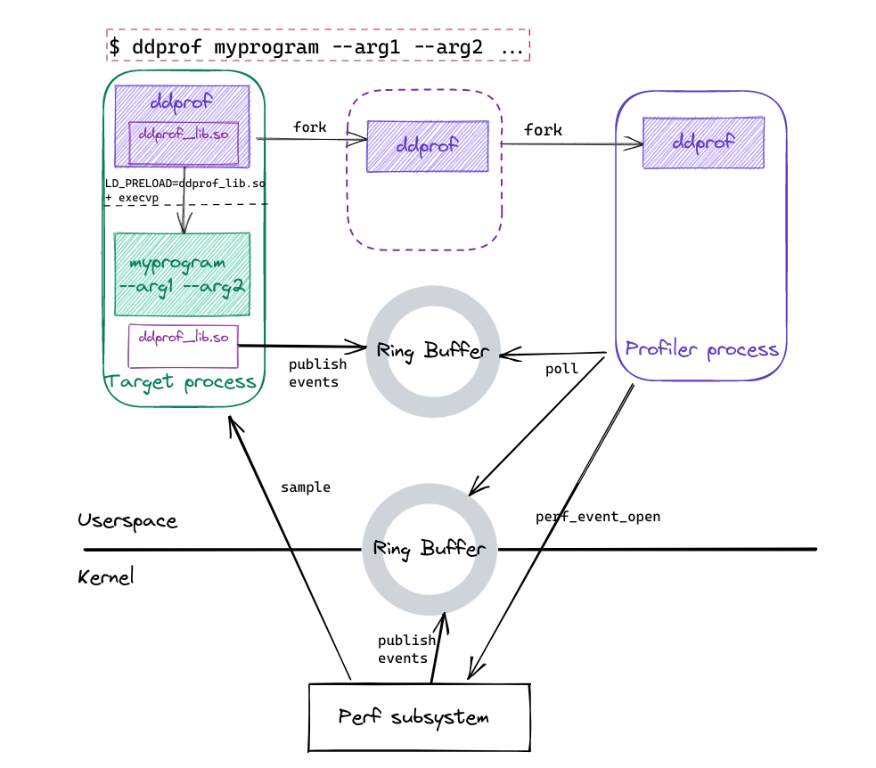

# Design

Overview of the `ddprof` architecture

## Architecture

`ddprof` is a sample based profiler. It uses a mix of user space instrumentation and kernel APIs.
`ddprof` runs in a separate process and processes events through shared ring buffers.

