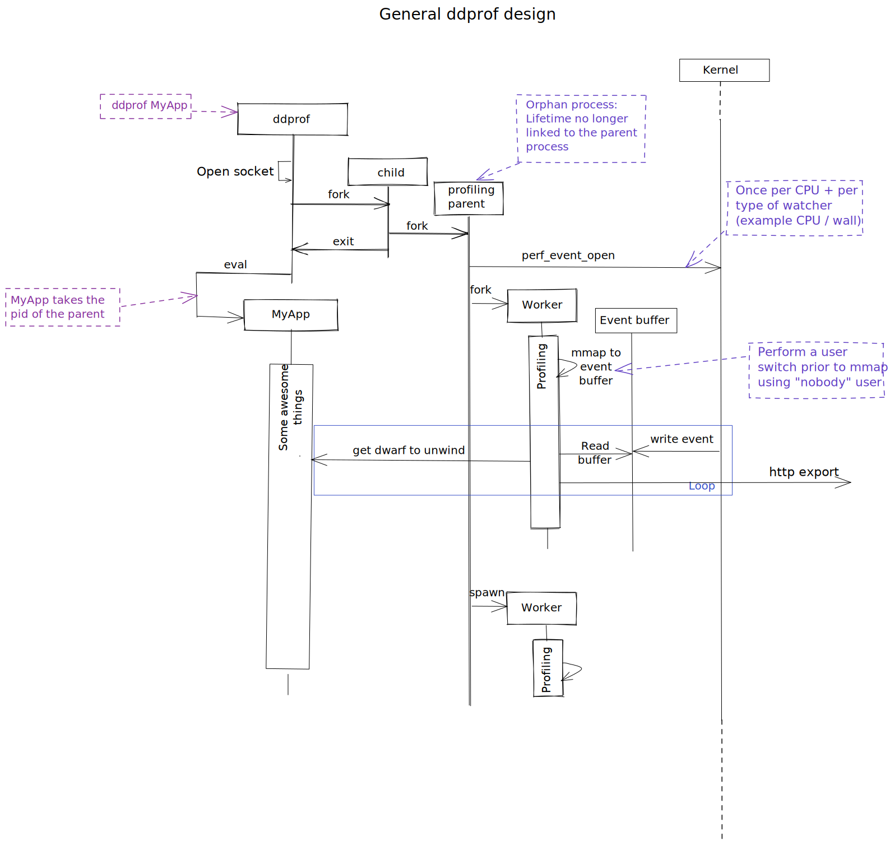

# Design

Design discussions.

## Architecture

Roughly speaking, the profiler performs the following operations in sequence.

* Instantiated by OS
* Processes options, environment variables, etc
* Initializes global objects and memory
* Creates a pipe (two linked sockets), setting the socket type to be a Unix
  Domain Socket.  This will be used for transferring file descriptors
* Sets up a pthreads barrier in a shared-memory region, with a shared
  disposition (otherwise pthreads fails to use it properly) for coordination
* Calls fork() to create a child
* The child calls fork() and dies
* The original process iteratively calls `perf_event_open()` and sends the
  resulting file descriptor to the grandchild using a unix domain socket, then
  enters the pthread barrier.  Iteration is done for each watcher, on each
  CPU, since the `perf_event_open()` context is restricted.
* Grandchild receives the file descriptors, clears the thread barrier
* Original process closes the file descriptor and repeats until all watchers
  have been enabled on all CPUs.
* Both processes close their unix domain sockets
* Grandchild creates one mmap() region to receive the `perf_event_open()`
  ringbuffer
* Original process calls `execvp()` to become the target process with args
* Grandchild `poll()`s on received file descriptors to listen for events in
  ringbuffer

## Overview

### Notes

* the grandchild does not read from stdio, so it should not be necessary to
  close any of the underlying streams.  But we could once we have better
  logging facilities.
* We don't do anything to set the signal disposition of the grandchild or
  original process.
* We should, but do not, do any resource isolation or limiting yet.

## Architecture painpoints

### Instrumentation Sequence

**Problem**
ddprof needs to enable instrumentation for the process it wraps.  If this
fails, we want the target process to get launched anyway.  It would also
be great if instrumentation happened after the profiler gets launched
(i.e., don't profile the profiler in the common case).  Basically, we'd
like to:

* Minimize the permissions escalations required to instrument an application
* Ensure that hierarchical resource sandboxing interfaces, such as cgroups,
  can be easily used in a large number of kernel versions to clamp ddprof
  (i.e., don't rely on cool new cgroups v2 kernel v5.bignum features)
* Have an instrumentation sequence that could allow profiles to be collected
  in a separate container entirely
* Suppress SIGCHLD in instrumented application if the profiler dies (SIGCHLD
  can be used as a job control mechanism; we don't want to interfere, but
  sometimes we can't help dying)
* A higher-order executor (for example, `strace ddprof app`) must receive the
  PID of the _application_ and not the PID of ddprof through fork().  In other
  words, the PID of the process must be the PID of the service, not the wrapper
* Isolate the instrumented application from hierarchical limits (e.g.,
  those in `getrlimit()`

Of these goals, the first five are satisfied in the current implementation of
ddprof, with the last one being tricky to implement on containerized
environments without breaking containerization.  We'll provide a discussion on
an alternative mechanism (option 3 above) which gets over this hurdle for
`perf_event_open()`-facilitated instrumentation.

## Ideas

### Alternative timing mode

For a variety of reasons, we thought of launching with `perf_event_open()`.  We could also measure time using the standard `set_itimer()` approach.  There are a few unfortunate consequences to this:

* itimers are mediated through Unix signals, which steal execution from the instrumented process (adds latency)
* signals have more skid than the kernel code, sometimes by a truly significant margin
* signals can interrupt syscalls, which can break client code
* signals don't follow forks
* have to implement new message passing system to bring samples up from children
* signal delivery is non-uniform through a thread pool--this isn't an academic point, sampling hugely favors the earliest-spawned thread
* users can over-write signal handlers

Some of this can be controlled for by implementing an LD_PRELOAD-type trick inside of a wrapper, which could catch `fork()` calls into libc and implement some other niceties, but I'm not sure how much effort this will be to support both glibc/musl across the major versions we have to support.
